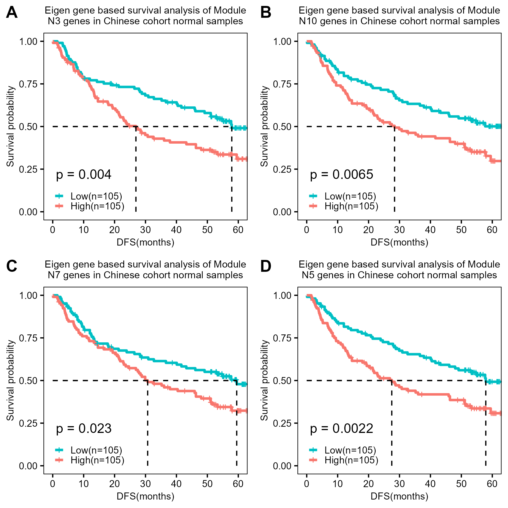

# Introduction
The analysis below explores the capability of eigen gene expression in predicting the 
disease-free survival from gene expression of Chinese cohort HCC data.  


# Library and utility scripts
Loading libraries and custom functions for the analysis.

```{r include = F}
knitr::opts_chunk$set(
  collapse = TRUE,
  message = FALSE,     # Show messages in output
  warning = FALSE,     # Show warnings in output
  results = "hide"
)

```
```{r }
library(tidyverse)
library(survival)
library(openxlsx)
library(GEOquery)
library(WGCNA)
library(survminer)
```

Load the clinical trait data `traitData` of HCC patient Chinese cohort 

```{r }
traitData = readRDS("data/chinese_hcc_patient_trait.rds")
```

Load the gene expression data `g1` of HCC patient Chinese cohort 

```{r }
g1 = readRDS("data/chinese_hcc_patient_gene_expression.rds")
```

These are the modules of genes which showed significant correlation with the clinical traits (HCC stage) in
another HCC cohort (Korean). 
Extraction of these modules is an analysis by itself. So it is not presented here. However, we will use these
set of genes in each module to construct eigen gene and subsequently perform survival analysis.

```{r }
module_names = c("black","greenyellow","magenta","purple")

module_nomen = c("N3","N10","N7","N5") %>% setNames(module_names)

qq = vector("list",length(module_names) ) %>% setNames(module_names)
```

Loop over each module for survival analysis

```{r }
for (i in module_names){   
  
  # Load the module genes from the excel file
  desired_module = read.xlsx("data/normals_wgcna_modules.xlsx", 
                           sheet = i)$symbol 
  
  # Match the probe id of each gene in the current module with Chinese cohort gene expression data
  probe2gene = cbind(featureData(g1)[[1]], featureData(g1)[[11]] ) %>% as.data.frame %>%
    setNames(c("probe","gene")) %>% subset(gene %in% desired_module)
  
  # Setting the figure dimensions
  dpi=300
  w = 3
  conversion=1/524*(dpi*w)/dpi*72
  
  # Building the eigen gene from Chinese cohort gene expression data
  eigen_exp = moduleEigengenes(expr = exprs(g1)[probe2gene$probe, rownames(traitData)] %>% t,
                               colors = rep("test", nrow(probe2gene)) ) %>% .$eigengenes
  
  # Prepare the input for survival analysis 
   survival_input = traitData %>% cbind(eigen_exp[rownames(.),,drop=F]) %>%
    mutate(MEtest = ifelse(MEtest < median(MEtest), 1,2 ) )
  
  png(paste0("results/chinese_",i,"_eigen.png"), width = 3, height = 3, units = "in", res = 300)
  
  # Generate the survival plot
  p=survfit(Surv(DFS,DFS_status) ~ MEtest, data = survival_input) %>% 
    ggsurvplot(pval = T,pval.method = F, surv.median.line = "hv",pval.size = 4,pval.coord= c(1,0.22),
               censor.size = 3,
               legend.title= element_blank(),
               title = paste0("Eigen gene based survival analysis of Module\n",module_nomen[i],
                              " genes in Chinese cohort normal samples"),
               xlab = "DFS(months)",
               legend = c(0.22,0.1),
               legend.labs =c(paste0("Low(n=",sum(survival_input$MEtest == 1),")"),
                              paste0("High(n=",sum(survival_input$MEtest == 2),")")),
               break.time.by = 10,
               ggtheme = theme_bw()+
                 theme(panel.grid = element_blank(), 
                       axis.text = element_text(size=20*conversion, color="black"),
                       axis.title  = element_text(size=20*conversion, color="black"),
                       legend.title = element_blank(),
                       legend.text = element_text(size = 20*conversion, color="black"),
                       plot.title = element_text(size = 20.5*conversion, color="black", hjust = 0.5),
                       panel.border = element_rect(color="black"),
                       legend.key.size = unit(1,"pt"), legend.spacing.y = unit(-1,"pt")),
               palette = c("#00BFC4","#F8766D"),risk.table = F, cumevents = F )
  qq[[i]] = p$plot
  print(p)
  dev.off()
}
```

Arrange the multiple survival plots using ggarrange

```{r }
ggsave(filename = "results/chinese_cohort_dfs.png", width=6, height=6, units="in", device="png", dpi = 300,
       plot=ggarrange(qq$black,qq$greenyellow,qq$magenta,qq$purple, nrow=2, ncol=2,
                      labels = LETTERS[1:4]) )
```

## Disease-free survival plots based on Eigen gene expression
{width = 6in, height = 6in}  
