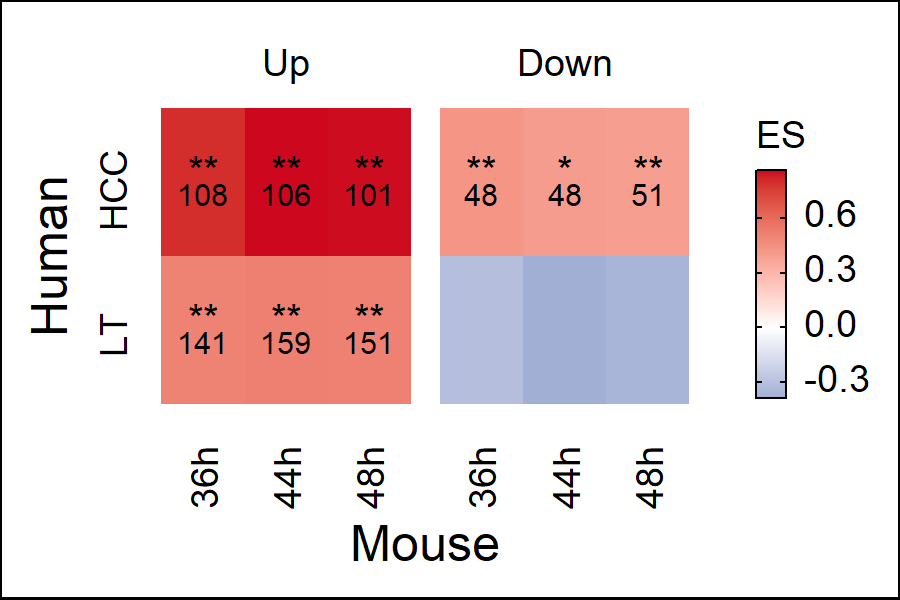
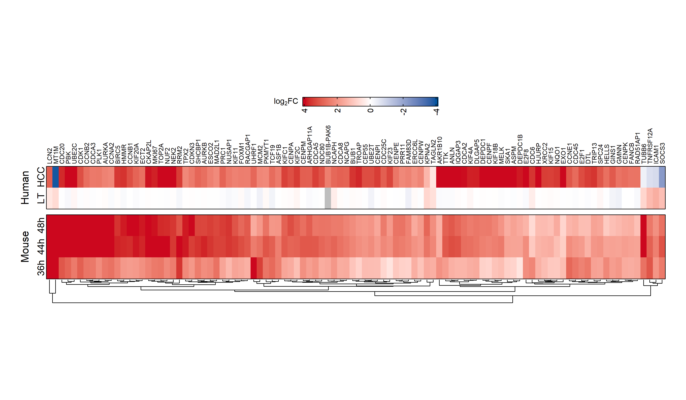
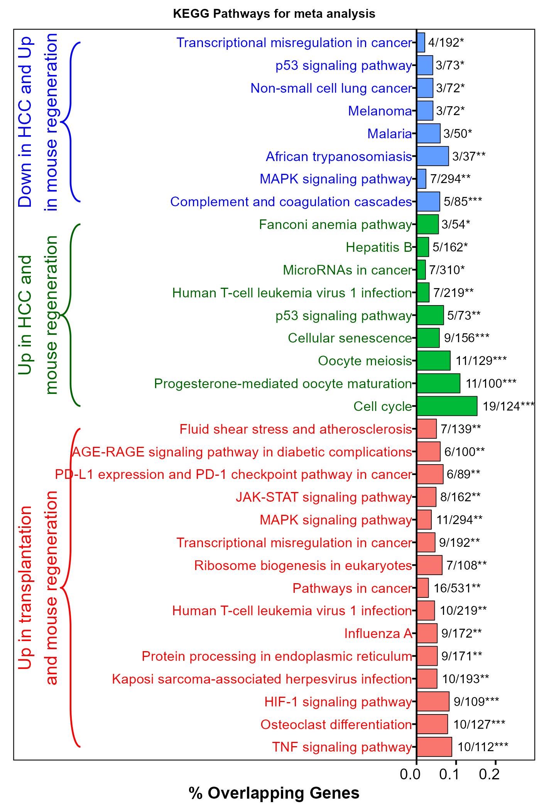

```{r include = F}
knitr::opts_chunk$set(
  collapse = TRUE,
  message = FALSE,     # Show messages in output
  warning = FALSE,     # Show warnings in output
  results = "hide"
)
```

# Introduction
The analysis performed here identifies consistently regulated genes from mouse, HCC, 
and transplantation transcriptomic datasets.  


# Library and utility scripts
Loading libraries and custom functions for the analysis.

```{r message = F}
library(tidyverse)
library(tidylog)
library(here)
library(readxl)
library(glue)
library(tidytext)
library(janitor)
library(fgsea)
library(dorothea)
library(progeny)
library(biobroom)
library(circlize)
library(AachenColorPalette)
library(lemon)
library(VennDiagram)
library(ComplexHeatmap)
library(gridExtra)
library(cowplot)
library(ggpubr)
library(UpSetR)
library(ggwordcloud)
library(patchwork)
library(enrichR)
library(openxlsx)
library(scales)
library(annotables)
library(msigdf) # remotes::install_github("ToledoEM/msigdf@v7.1")
library(gtools)


options("tidylog.display" = list(print))
source("scripts/utils-utils.R")
source("scripts/utils-plots.R")
source("scripts/custom_functions.R")
source("scripts/axis_customise.R")


```
```{r }
#Graphical parameters 
fz <- 9
# color function for heatmaps
col_fun <- colorRamp2(
  c(-4, 0, 4),
  c(aachen_color("blue"), "white", aachen_color("red"))
)
```

# Meta-analysis
## Merging mouse liver regeneration data from different time points of the mid-phase 

```{r message = F}
mouse_degs = 
  read.table("data/exp_X36H-C0H.txt", header = T) %>% mutate(contrast = "x36h-c0")  %>%
  rbind(read.table("data/exp_X44H-C0H.txt", header = T) %>% mutate(contrast = "x44h-c0") )  %>%
  rbind(read.table("data/exp_X48H-C0H.txt", header = T) %>% mutate(contrast = "x48h-c0") ) %>%
  setNames(c("gene","logFC","pval","fdr","contrast")) %>% .[,c(1,5,2,3,4)] %>% as_tibble() %>% 
  group_by(contrast,gene) %>% filter(fdr == min(fdr)) %>% assign_deg() 
```

Mapping mouse gene sysmbols

```{r }
mapped_degs = mouse_degs %>% translate_gene_ids(from = "symbol_mgi", to = "symbol_hgnc") %>%
  drop_na() %>% group_by(contrast, gene) %>%
  slice_max(order_by = abs(logFC), n = 1, with_ties = F) %>%
  ungroup()
```

Make a ranked list of genes for mouse data which will be further used as input for Gene Set Enrichment Analysis (GSEA)
`signature_df` holds the rank list of genes

```{r }
signature_df <- mapped_degs %>%
  untdy("gene", "contrast", "logFC")   #untdy sets gene as the row and puts contrast as column, logFC as entry in [gene, contrast]
```

Reading the DEG analysis file of transplantation data

```{r }
transplantation = readRDS("data/transplantation_limma_result.rds") %>%
  dplyr:: select(gene, contrast,logFC, pval, fdr, regulation) %>%
  mutate(phenotype = "transplantation") %>%
  filter(gene %in% (grch38 %>% filter(biotype == "protein_coding") %>% pull(symbol) %>%
                      unique) )
```

Reading the DEG analysis file of HCC data

```{r }
hcc = readRDS("data/hcc_limma_results.rds") %>% as_tibble() %>%
  dplyr:: select(gene, contrast,logFC, pval, fdr, regulation)  %>%
  mutate(phenotype = "hcc") %>% 
  filter(gene %in% (grch38 %>% filter(biotype == "protein_coding") %>% pull(symbol) %>%
                      unique) )
```

## Merging HCC and transplantation data

```{r }
contrasts = bind_rows(transplantation, hcc) 
```

Summarising the no. of up and down-regulated genes in HCC and transplantation data

```{r }
aa=contrasts %>%
  mutate(direction = case_when(
    sign(logFC) >= 0 ~ "up",
    sign(logFC) < 0 ~ "down"
  )) %>% distinct(phenotype, contrast, direction, gene) %>% 
  count(phenotype, contrast, direction)
```

`aa` shows the no. of up and down regulated genes from HCC and transplantation data

```{r }
aa
```

Extracting top 500 up and down regulated genes from HCC and transplantation data

```{r }
genesets_top <- contrasts %>%
  mutate(direction = case_when(
    sign(logFC) >= 0 ~ "up",
    sign(logFC) < 0 ~ "down"
  )) %>%
  group_by(phenotype, contrast, direction) %>%
  top_n(500, abs(logFC)) %>%
  ungroup() %>%
  unite(geneset, phenotype, contrast, sep = "-") %>%
  unite(geneset, geneset, direction, sep = "|") %>%
  mutate(geneset = as_factor(geneset)) %>%
  select(geneset, gene)

cc = genesets_top %>% distinct(geneset, gene) %>% 
  count(geneset,name = "top_500_genes")
```

`genesets_top` holds top 500 up and down regulated genes from human data and its summary can be found in `cc`

```{r }
genesets_top
cc
```

Note: Within the same data, a gene can either be upregulated or down-regulated. 
But a gene that is upregulated in one data can be down regulated in the other and vice versa.

```{r }
dd = 
  genesets_top %>% distinct(gene, geneset) %>% count(gene) %>% 
  arrange(desc(n)) %>% distinct(n, gene) %>% count(n) %>% 
  setNames(c("No. of sets found", "No. of Genes"))
```

Total no. of unique genes in `geneset_top` is `dd$`No. of Genes` %>% sum()` with `dd$`No. of Genes`[1]`
found in one dataset and `dd$`No. of Genes`[1]` found in both the datasets.

```{r }
dd
dd$`No. of Genes`[1] + dd$`No. of Genes`[2]*2 == nrow(genesets_top)
```

Open a folder to save the output of intermediate results

```{r }
if (!dir.exists("output")){
  dir.create("output")
}
```

## Running GSEA using fgsea package  
Inputs are ranked list of genes `signature_df` and `genesets_top`.
Given a ranked list of genes and a geneset, fgsea aims to determine if members of geneset are overrepresented in the
top or bottom of ranked gene list

```{r }
set.seed(123)
gsea_res_top <- run_gsea(signature_df, genesets_top, tidy = T) %>%
  separate(geneset, into = c("geneset", "direction"), sep = "[|]") %>%
  separate(geneset,
           into = c("phenotype", "contrast"), sep = "-",
           remove = F
  ) %>%
  mutate(
    signature = as_factor(signature),
    geneset = as_factor(geneset),
    time = parse_number(as.character(signature))
  )
```

`gg` gives a summary of each combination of comparision between human and mouse dataset.  
If fgsea_score_ES > 0 for Direction == up implies, genes in both human and mouse data are consistently up-regulated.  
If fgsea_score_ES < 0 for Direction == down implies, genes in both human and mouse data are consistently down-regulated.  

```{r }
gg = gsea_res_top %>% mutate(ss = gsea_res_top$geneset %>% 
                               paste0("|",gsea_res_top$direction)) %>% 
  mutate(No_genes_in_mouse  = nrow(signature_df)) %>% 
  mutate(No_of_genes_in_human = 500) %>% 
  mutate(leading_edges = gsea_res_top %>% 
           apply(1, function(x) x$leadingEdge %>% unlist %>% length) ) %>%
  select(No_genes_in_mouse,No_of_genes_in_human,signature, ss, 
         size, direction, ES, NES, pval, padj,leading_edges) %>%
  setNames(c("No_of_genes_in_mouse","No_of_genes_in_human",
             "Mouse_contrasrt","Human_contrast","Intersection","Direction",
             "fgsea_score_ES","fgsea_score_NS","fgsea_pval","fgsea_padj",
             "leading_edges")) %>%
  filter(fgsea_padj <= 0.05 & (Direction == "up" & fgsea_score_ES >= 0) |
           (Direction == "down" & fgsea_score_ES < 0))
gg
saveRDS(gsea_res_top, "output/gsea_res.rds")
```

## Visualizing GSEA results with Enrichment scores (ES) and saving the images

```{r }
# summary gsea plot
#dev.new(width = 3, height = 2, units = "in", noRStudioGD = T)
w=3
dpi=300
conversion=1/524*(dpi*w)/dpi*96
png(filename = "results/gsea_heatmap.png", width = 3, height = 2, units = "in", 
      res = 300)
gsea_res_top %>% 
  mutate(direction = ifelse(direction %>% grepl("down",.), "Down","Up"  ) %>%
           factor(levels = c("Up", "Down")) ) %>%
  mutate(geneset = ifelse(grepl("trans",geneset),"LT","HCC")  %>% 
           factor(levels = c("LT","HCC") )  ) %>%
  mutate(signature =  rep(c("36h","44h","48h"),each = 4) %>%
           factor(levels = c("36h","44h","48h") )) %>%
  mutate(label = stars.pval(padj)) %>%
  rowwise() %>% 
  mutate(leading_edge_size = ifelse(padj < 0.05, 
                                    leadingEdge %>% length %>% as.character ,"") ) %>%
  mutate(label2 = factor(leading_edge_size, levels = leading_edge_size   )    )   %>%
  
  ggplot(aes(x = signature, y = geneset, fill = ES)) +
  geom_tile() +
  geom_text(aes(label = label), size = fz / (14 / 5), vjust = 0) +
  geom_text(aes(label = label2), size = 7/ (14 / 5), vjust = 1) +
  facet_wrap(~direction,ncol = 2) +
  theme(axis.title = element_text(size = 22*conversion),
        axis.text.x = element_text(angle = 90, vjust = 0.5, hjust= -1),
        axis.text.y = element_text(angle = 90, vjust = 0, hjust=0.6),
        axis.line = element_blank(),axis.ticks = element_blank(),
        #legend.position = c(1,0.55),legend.direction = "vertical",
        panel.spacing = unit(0.2,"lines"),
        plot.background = element_rect(color = "black")
  ) +
  scale_fill_gradient2(
    low = aachen_color("blue"), mid = "white",
    high = aachen_color("red")
  ) +
  my_theme(grid = "no", fsize = fz) +
  labs(x = "Mouse", y = "Human", fill = "ES") +
  guides(fill = guide_colorbar(title = "ES", ticks.linewidth = 0.3,
                               barwidth = 0.5, barheight = 3.8,frame.colour = "black",
                               frame.linewidth = 0.3,ticks.colour = "black", label.vjust =0.3))
dev.off()
```

## Enrichment score plot
{width = 3in, height = 2in}  
Extracting leading edges (genes) contributing for significant ES scores in the above plot

```{r }
gsea_res <- readRDS( "output/gsea_res.rds")
```

Writing excel sheets 

```{r }
gsea_res %>% 
  unite(naming, signature, contrast, direction, sep="|") %>% 
  rowwise() %>% mutate(leading_edge_size = leadingEdge %>% length) %>%
  dplyr::select(naming, padj, ES, size, leading_edge_size) %>% 
  write.xlsx("output/gsea_inital_results.xlsx")

gsea_res %>%
  filter(padj <= 0.05 &
           ((direction == "up" & ES >= 0) | (direction == "down" & ES < 0))  ) %>%
  unite(naming, signature, contrast, direction, sep="|") %>% 
  rowwise() %>% mutate(leading_edge_size = leadingEdge %>% length) %>%
  dplyr::select(naming, padj, ES, size, leading_edge_size) %>% 
  write.xlsx("output/gsea_filtered_results.xlsx")
```

Leading edges

```{r }
leading_edges <- gsea_res %>%
  filter(padj <= 0.05 &
           ((direction == "up" & ES >= 0) | (direction == "down" & ES < 0))  )%>%
  unnest(leadingEdge) %>%
  rename(gene = leadingEdge)

gsea_res %>% 
  filter(padj <= 0.05 &
           ( (direction == "up" & ES >= 0) | (direction == "down" & ES < 0))  ) %>% 
  unite(naming, signature, contrast, direction, sep="|") %>% 
  apply(1, function(s) s$leadingEdge %>% list %>% setNames(s$naming)) %>% 
  unlist(recursive = F)  %>% write.xlsx("results/leading_edges_meta_analysis.xlsx")

gsea_res %>% 
  filter(padj <= 0.05 &
           ( (direction == "up" & ES < 0) | (direction == "down" & ES >= 0))  ) %>% 
  unite(naming, signature, contrast, direction, sep="|") %>% 
  apply(1, function(s) s$leadingEdge %>% list %>% setNames(s$naming)) %>% 
  unlist(recursive = F)  %>% write.xlsx("output/inconsistent_leading_edges_filtered.xlsx")

saveRDS(leading_edges,"output/individual_le.rds")

unified_le <- leading_edges %>%
  distinct(signature, direction, time, phenotype, gene) %>%
  count(signature, gene, direction, sort = T, name = "n_studies") 

unified_le_mgi <- unified_le %>%
  translate_gene_ids(from = "symbol_hgnc", to = "symbol_mgi") %>%
  distinct(direction, gene, signature) %>%
  # remove predicted genes
  filter(!str_detect(gene, "Gm[0-9]+"))

c <- mapped_degs %>%
  inner_join(unified_le, by = "gene") %>%
  mutate(class = "mouse") %>%
  select(gene, contrast, logFC, class)

h <- contrasts %>% 
  inner_join(unified_le, by = "gene") %>%
  mutate(class = "human") %>%
  unite(contrast, phenotype, contrast, sep = "-") %>%
  select(gene, contrast, logFC, class)

df <- bind_rows(c, h) %>%
  mutate(contrast = as_factor(contrast)) %>%
  distinct()
```

## Heatmap of leading edges using ComplexHeatmap package

```{r }
df_ranked <- df %>%
  group_by(gene) %>%
  summarise(mean_logfc = mean(logFC)) %>%
  transmute(gene, rank = row_number(-abs(mean_logfc))) %>%
  inner_join(df, by = "gene")


mat <- df_ranked %>%
  filter(rank <= 100) %>%
  distinct(gene, contrast, logFC) %>%
  untdy(feature = "gene", key = "contrast", value = "logFC") %>%
  as.matrix() %>% `colnames<-`(c("36h","44h","48h","LT","HCC"))


mat = mat[,c(3,2,1,5,4)]
png(filename = "results/meta_analysis_consistent_genes.png", width = 12, height = 7, units = "in", 
      res = 300)
ComplexHeatmap::Heatmap(t(as.matrix(mat)),
                        col = col_fun,
                        cluster_rows = F,
                        cluster_columns = T,column_names_rot = 90,
                        column_names_side = "top",
                        row_names_side = "left",
                        column_dend_side = "bottom",column_dend_height = unit(2,"lines"),
                        row_names_gp = gpar(fontsize = 12), column_names_gp = gpar(fontsize = 8),
                        name = "logFC",
                        row_gap = unit(2.5, "mm"),
                        border = T,
                        row_split = c(rep("Mouse", 3), rep("Human", 2)), 
                        height = 10*unit(5, "mm"),width  = 55*unit(5, "mm"),row_names_rot = 90,
                        row_names_centered = T,
                        heatmap_legend_param = list(legend_direction = "horizontal",
                                                    title = expression(log[2]*"FC"),
                                                    title_position = "lefttop",
                                                    border = "black",legend_width = unit(6, "cm"),                 
                                                    labels_rot =90,at = seq(-4,4,2) %>% rev) ) %>%
  draw(heatmap_legend_side = "top")
dev.off()
```

## Leading edges (genes) heatmap
{width = 12in, height = 7in}  


## Visualization of GSEA plots for meta anlalysis using ggplot2 and cowplot packages  
Combined gsea plots across every time of mouse data (36, 44, 48h) and human data  
Preparing the data

```{r message=FALSE, warning=FALSE}
stats_df = data.frame(gene = numeric(), stat = numeric(), rank = numeric(),gset = character(),
                      model = character(), time = character(), direction = character())
enrichment_df = data.frame(rank = numeric(),running_sum = numeric(),
                           max_top = numeric(), min_bottom =numeric(),gset = character(),
                           model = character(), time = character(), direction = character())
gene_positions = data.frame(rank = numeric(), gset = character(),
                            model = character(), time = character(), direction = character())
top_es = data.frame(rank = numeric(),running_sum = numeric(),
                    max_top = numeric(), min_bottom =numeric(),gset = character(),
                    model = character(), time = character(), direction = character(),
                    padj = numeric())

for (i in gsea_res_top$geneset %>% unique){ 
  for (j in gsea_res_top$signature %>% unique) {
    for (k in gsea_res_top$direction %>% unique) {
      xx = paste0(i, "|",k)
      m3 = input4gseaplot(
        signature = signature_df %>%
          rownames_to_column("gene") %>%
          select(gene, t = j) %>%
          drop_na(),
        geneset = genesets_top %>%
          filter(geneset == xx),
        gene_level_stat = t, 
        pval_stars = gsea_res_top %>% filter(geneset == i &
                                               signature == j & direction == k) %>%
          pull(padj) %>% stars.pval(),
        category = paste0(i,"|",j,"|",k)
      )
      stats_df = rbind(stats_df, m3$stats_df %>% mutate(model = i, time = j, direction = k)) 
      enrichment_df = rbind(enrichment_df, m3$enrichment_df %>% 
                              mutate(model = i, time = j, direction = k))
      gene_positions = rbind(gene_positions, m3$gene_positions %>% 
                               mutate(model = i, time = j, direction = k))
      top_es = rbind(top_es, m3$top_es %>% mutate(model = i, time = j, direction = k))
    }}}
```

ggplot for combined GSEA and saving them to png files

```{r message=FALSE, warning=FALSE}
w=3.2
dpi=300
conversion=1/524*(dpi*w)/dpi*96
for (j in gsea_res_top$signature %>% unique) {
  fname = paste0("results/",j,"_gseaplot.png")
  png(fname,width = 3.2, height = 3.2, units = "in", 
       res = 300)
  p1=ggplot(data = enrichment_df %>% filter(time == j) %>%
              mutate(gset = factor(gset, levels = unique(gset))) , 
            aes(x = rank, y = running_sum, color = gset)) + 
    geom_path(size = 0.5, linetype = "solid",aes(color = gset) )+
    geom_hline(yintercept = top_es %>% filter(time == j) %>% .$running_sum,
               colour = hue_pal()(4), linetype = "dashed")+
    geom_hline(yintercept = 0, colour = "black")+theme_bw()+
    geom_segment(data = top_es %>% filter(time == j), 
                 mapping = aes(x = rank, y = 0, xend = rank, yend = running_sum, color =gset), 
                 linetype = "dashed", size = 0.5) +
    ggrepel::geom_text_repel(data = top_es %>% filter(time == j) %>%
                               mutate(model = ifelse(grepl("trans", model), "TH", "HCC" ) %>%
                                        factor(levels = c("TH","HCC") ) ) %>%
                               mutate(score = paste0("ES: ", round(running_sum,2),
                                                     padj, "(",model,"; ",direction,")" ) %>%
                                        factor(levels = unique (.)) ) %>%
                               mutate(xcor =ifelse(running_sum > 0, 7000, 1)) %>%
                               mutate(rs = ifelse(running_sum > 0, running_sum +0.03, running_sum - 0.02)),
                             mapping = aes(x = xcor, y = rs , label = score,color = gset),
                             hjust = 0)+
    ggtitle(paste0("Meta analysis of Human and Mouse DEGs(",j,")"))+
    theme(plot.title = element_text(size  = 6))+
  cowplot::background_grid(major = "y", minor = "none", size.major = 0.4) +
    theme(
      axis.line.x = element_blank(),
      axis.title.x = element_blank(),
      axis.title = element_blank(),
      axis.ticks.x = element_blank(),
      axis.text.x = element_blank(),
      # plot.margin = unit(c(1, 1, -0.25, 1), "cm"),
      plot.margin = unit(c(0.2, 0.4, -0.25, 0.2), "cm"),
      legend.position = "none",
      panel.grid = element_blank(),
      panel.background  = element_rect(color="black"),
      title = element_text(size = 1),
      axis.text = element_text(size = 10, color = "black"),
      #axis.title = element_text(size = 13)
    )
  
  
  max_rank = stats_df %>% filter(time == j &
                                   gset == paste0("transplantation-post_vs_base|",j,"|up") ) %>%
    pull(rank) %>%
    max()
  
  p2 <- ggplot(stats_df %>% filter(time == j &
                                     gset == paste0("transplantation-post_vs_base|",j,"|up")),
               aes(x = rank, y = 1)) +
    geom_tile(aes(color = rank)) +
    #geom_bar(aes(color = rank)) +
    geom_segment(gene_positions %>% filter(time == j &
                                             gset == paste0("transplantation-post_vs_base|",j,"|up") ),
                 mapping = aes(x = rank, y = 1.51, xend = rank, yend = 3.51),
                 size = 0.5, color = hue_pal()(4)[1] , alpha = 0.5
    ) +
    geom_segment(gene_positions %>% filter(time == j &
                                             gset == paste0("transplantation-post_vs_base|",j,"|down") ),
                 mapping = aes(x = rank, y = 3.53, xend = rank, yend = 5.53),
                 size = 0.5, color = hue_pal()(4)[2] , alpha = 0.5
    )+
    geom_segment(gene_positions %>% filter(time == j &
                                             gset == paste0("hcc-T_vs_N|",j,"|up") ),
                 mapping = aes(x = rank, y = 5.55, xend = rank, yend = 7.55),
                 size = 0.5, color = hue_pal()(4)[3] , alpha = 0.5
    ) +
    geom_segment(gene_positions %>% filter(time == j &
                                             gset == paste0("hcc-T_vs_N|",j,"|down") ),
                 mapping = aes(x = rank, y = 7.57, xend = rank, yend = 9.57),
                 size = 0.5, color = hue_pal()(4)[4] , alpha = 0.5
    ) +
    scale_color_gradientn(
      colours = c(
        "#A11035", "#F6A800", "#FFED00",
        "#57AB27", "#00549F", "#612158"
      ),
      breaks = c(1, max_rank / 2, max_rank),
      labels = c("High", "", "Low")
    ) +
    theme(
      axis.ticks.y = element_blank(),
      axis.text.y = element_blank(),
      axis.text.x = element_text(),
      plot.margin = unit(c(0.2, 0.4, 0, 0.2), "cm"),
      axis.line.x = element_blank(),
      title = element_text(size = 14),
      axis.text = element_text(size = 10),
      axis.title = element_blank(),
      panel.border  = element_rect(color="black"),
      panel.grid = element_blank(),
      legend.position = "none",
      legend.justification = element_blank()
    ) 
  p <- cowplot::plot_grid(p1, p2, ncol = 1, align = "v", axis = "l",
                          rel_heights = c(2, 1))
  print(p)
  dev.off()
  print(p)
  }
```

## Plotting enrichr results for pathway analysis 

```{r message=FALSE, warning=FALSE}
```

Reading the output of GSEA results and extracting leading edges for each comparision

```{r }
geneslists = list(gsea_res %>% filter(time != 72) %>%
                    unnest(leadingEdge) %>% rename(gene = leadingEdge) %>% 
                    filter(phenotype == "transplantation" & direction == "up") %>% pull(gene),
                  
                  gsea_res %>% filter(time != 72) %>% 
                    unnest(leadingEdge) %>% rename(gene = leadingEdge) %>% 
                    filter(phenotype == "hcc" & direction == "up") %>% pull(gene),
                  
                  gsea_res %>% filter(time != 72) %>%
                    unnest(leadingEdge) %>% rename(gene = leadingEdge) %>% 
                    filter(phenotype == "hcc" & direction == "down") %>% pull(gene))
```

Using enrichr for Biological Pathway analysis

```{r }
ll = geneslists %>% lapply(function(z) z %>% enrichr(databases = "KEGG_2021_Human") %>% .$KEGG_2021_Human %>%
                             dplyr::slice(1:15) %>% mutate(grouping = ifelse(Adjusted.P.value < 0.05,
                                                                             "Adj.Pval < 0.05","Adj.Pval > 0.05"))  %>%
                             mutate(grouping = factor(grouping,levels=unique(grouping))) %>%
                             mutate(x_position=-log10(P.value)/2) %>% rowwise %>%
                             mutate(Term = ifelse((Term %>% str_locate_all(" ") %>% .[[1]] %>% nrow) > 2,
                                                  str_wrap(Term, width = Term %>% str_locate_all(" ") %>% .[[1]] %>% .[3,] %>% unique ),Term )  ) %>% 
                             #mutate(Term = Term %>% lapply(term_wrapping) %>% unlist  ) %>% 
                             mutate(Term = factor(Term,levels=Term)) %>%
                             mutate(Overlap = paste0(Overlap, stars.pval(Adjusted.P.value))) %>%
                             mutate(Overlap = factor(Overlap, levels = unique(Overlap)) ) ) 
```

Preparing the dataframe from the output of enrichr to make final pathway plots

```{r }
ww = ll %>%  lapply(function(x) x %>% 
                      dplyr::select(Term, Overlap, x_position,P.value,Adjusted.P.value)) 

ww = ww %>% do.call(rbind,.) %>% cbind(c("Up in transplantation\nand mouse regeneration",
                                         "Up in HCC and\nmouse regeneration",
                                         "Down in HCC and Up\nin mouse regeneration") %>% 
                                         rep(each =15) ) %>% 
  setNames(c(names(.) %>% rev %>% .[-1] %>% rev, "grouping") ) %>%
  filter(Adjusted.P.value < 0.05) %>%
  mutate(grouping = factor(grouping, levels = unique(grouping)) ) %>% mutate(y_position=1:nrow(.))

combined_kegg = ww %>% mutate(Term = gsub("\n"," ",Term)) %>% mutate(Term = gsub(" \\(.*","",Term)) %>% 
  mutate(Term1 = Term %>% as.character() %>% limma::makeUnique() %>% 
           factor(levels = Term %>% as.character() %>% limma::makeUnique() ) ) %>%
  mutate(y0 = seq(1,nrow(.),1)) %>% 
  mutate(share =  Overlap %>% as.character() %>% gsub("\\*","",.) %>%
           strsplit("/") %>% lapply(as.numeric) %>% lapply(function(y) y[1]/y[2]) %>% unlist) %>%
  mutate(x3 = share/2) %>% 
  mutate(Term = as.character(Term) %>% gsub("\n"," ",.))


combined_kegg = combined_kegg %>% mutate(x2 = rep(-0.01, nrow(.)) ) 
```

ggplot for pathways

```{r }
w=4.7
dpi=300
conversion=1/524*(dpi*w)/dpi*96
g3=ggplot(data = combined_kegg) %+%
  geom_bar(aes(x=share,y=Term1, fill = grouping, size = 0.1*conversion),color = "black",
           stat="identity",size =0.2,width = 0.85)+theme_bw()+
  scale_y_discrete(breaks =  combined_kegg$Term1 %>% as.character, 
                   labels = combined_kegg$Term %>% as.character )  + 
  scale_x_continuous(limits = c(-1.02,0.3), expand = c(0,0),breaks = seq(0,0.25,by = 0.1))+
  geom_text(aes(x = share, y = Term1, label = Overlap),size=9/.pt*conversion, hjust = -0.1 )+
  geom_text(aes(x = x2, y =y0, label = Term),
            color = rep(c("red","darkgreen","blue"),combined_kegg$grouping %>% 
                          as.character() %>% rle %>% .$lengths),
            size=10/.pt*conversion, hjust = 1 , angle = 0)+
  theme(
    plot.title=element_text(size=9*conversion, hjust =0.5, face = "bold"),
    axis.text.x = element_text(color="black",size = 11*conversion, hjust = 0.8),
    axis.text.y = element_blank(),
    panel.grid.minor = element_blank(),
    panel.grid.major = element_blank(), panel.border = element_rect(color="black"),
    axis.title.x = element_text(size = 12*conversion,color="black", face = "bold"), 
    axis.title.y = element_blank(),
    axis.ticks = element_line(color = "black"))+
  xlab("% Overlapping Genes")+
  guides(fill = guide_legend(nrow = 1))+
  theme(legend.position = "none")+ggtitle("KEGG Pathways for meta analysis")+
  ggbrace::stat_brace(aes(x = share, y = y_position, color = grouping, label = grouping),
                      outerstart = -0.9,labelsize = 13/.pt*conversion, rotate = 270,width = 0.05,
                      labelrotate = 90)+
  scale_color_manual(values = c("red","darkgreen","blue") )
g3 = shift_axis_x(g3,0)
ggsave(filename = "results/meta_analysis_pathways.png", width =4.7, height = 7, units ="in", device = "png", dpi = 300,
       plot =g3)
```

## Pathway plot
{width = 4.7in, height = 7in}
